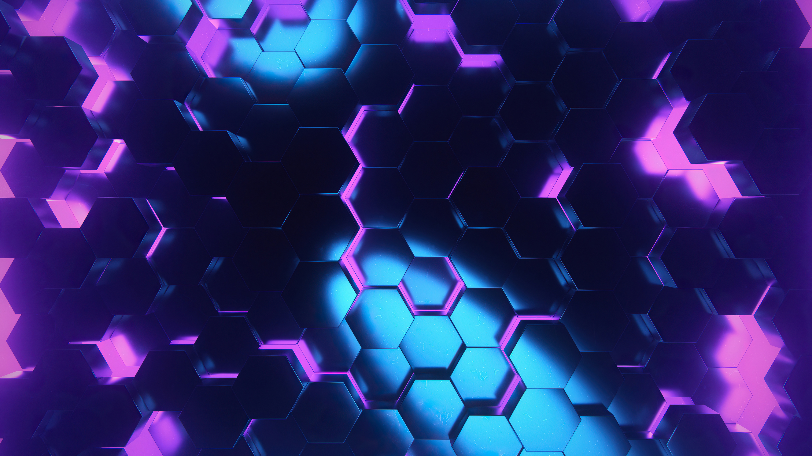
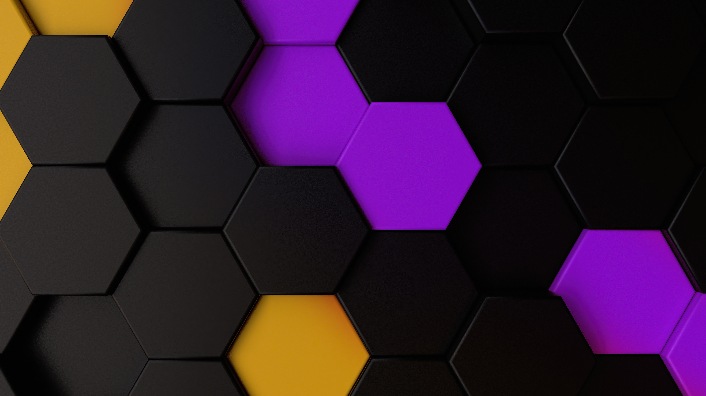
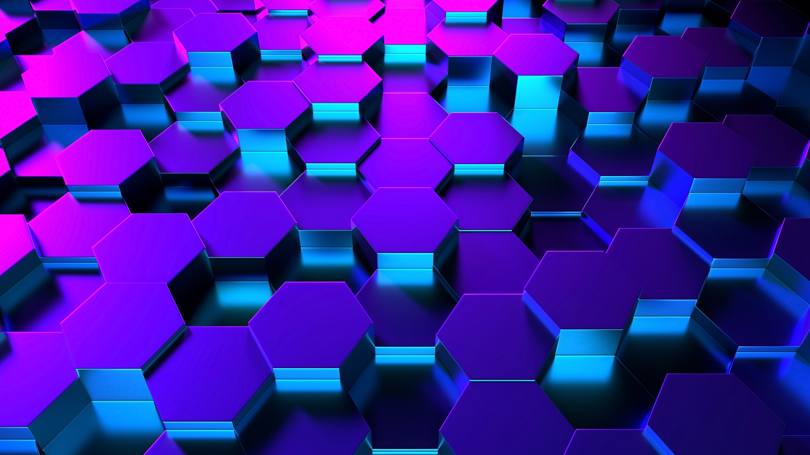
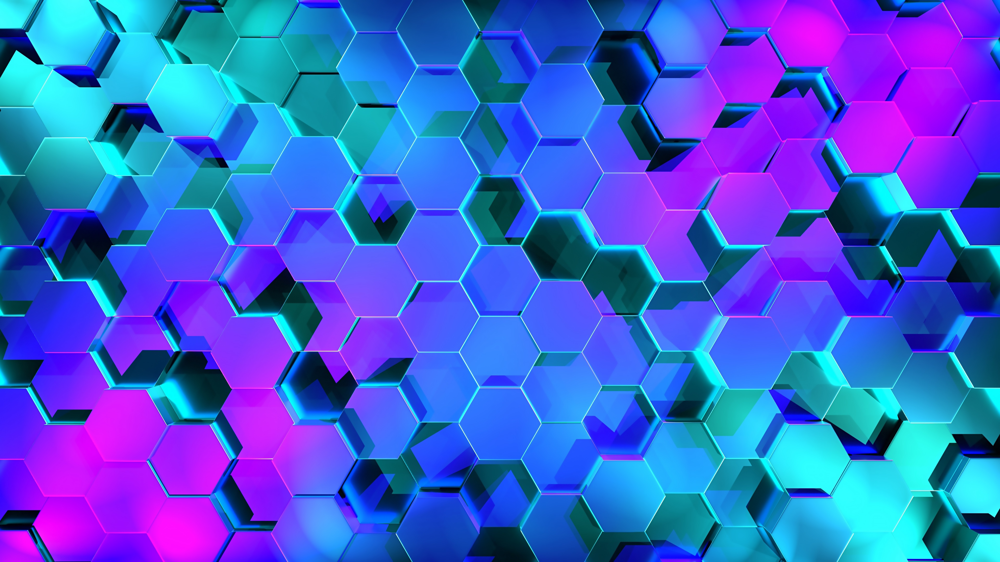
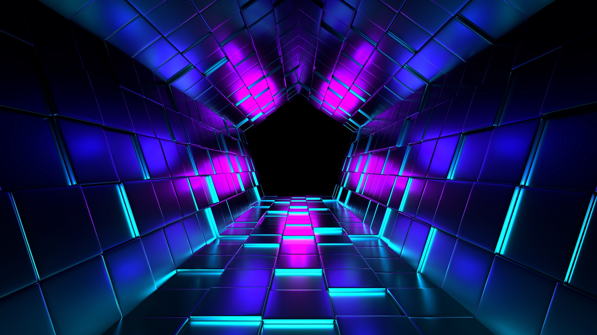

# Omarchy Hex Theme

A neon-leaning, dark theme with hexagonal stylings with magenta and cyan accents, for Omarchy.


## Install

Use the Omarchy theme installer:

```
omarchy-theme-install https://github.com/OldJobobo/omarchy-hex-theme
```

## Palette
### Synthwave Alpha
- Background: `#241b30`
- Foreground: `#f2f2e3`
- Accent magenta: `#ff00f6`
- Accent cyan: `#00fbfd`
- Blue: `#6e29ad`
- Red: `#e60a70`
- Green: `#00986c`
- Yellow: `#adad3e`

## Wallpapers

| | | |
| --- | --- | --- |
|  |  |  |
|  |  |  |

## Attribution

The Waybar theme is based on Hancore-Linux's V2.2 Waybar theme and has been heavily customized to fit this theme. https://github.com/HANCORE-linux/waybar-themes
